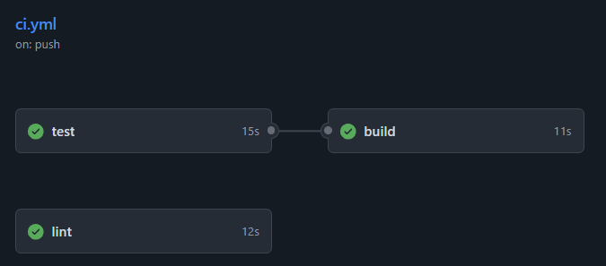

## 🔄 CI/CD Pipeline

This project includes GitHub Actions for continuous integration:

### Pipeline Jobs

| Job | Description | Status |
|-----|-------------|--------|
| **test** | Runs pytest test suite on every push/PR | ✅ |
| **build** | Builds and verifies Docker image | ✅ |
| **lint** | Checks code quality and formatting | ✅ |

The pipeline automatically runs on:
- Every push to `main` branch
- Every pull request

### Setting Up CI/CD

1. Push this repo to GitHub
2. Add your `GOOGLE_API_KEY` as a repository secret:
   - Go to Settings → Secrets → Actions
   - Add new secret: `GOOGLE_API_KEY`
3. The pipeline will run automatically on push!