# 📚 RAG Document Chat

[](https://www.python.org/downloads/)
[](https://streamlit.io/)
[](https://www.docker.com/)
[](https://langchain.com/)

> **An intelligent RAG (Retrieval-Augmented Generation) application that lets you chat with your PDF documents using Google Gemini AI.**


## 🎯 Overview

This project implements a production-ready **Retrieval-Augmented Generation (RAG)** system that allows users to:
- Upload PDF documents to a knowledge base
- Ask natural language questions about the documents
- Get AI-powered answers with source citations

## 🏗️ Architecture

```mermaid
flowchart LR
    subgraph Input
        A[📄 PDF Documents] --> B[PyPDF Loader]
    end
    
    subgraph Processing
        B --> C[Text Splitter]
        C --> D[Chunks]
        D --> E[Embeddings API]
    end
    
    subgraph Storage
        E --> F[(ChromaDB)]
    end
    
    subgraph Query
        G[❓ User Question] --> H[Embeddings API]
        H --> I[Similarity Search]
        F --> I
        I --> J[Relevant Chunks]
    end
    
    subgraph Generation
        J --> K[Context + Question]
        K --> L[Gemini LLM]
        L --> M[💬 Answer + Sources]
    end
```



## ✨ Features

- 🤖 **AI-Powered Chat** - Natural language Q&A with your documents
- 📄 **PDF Support** - Load multiple PDF files from a directory
- 🔍 **Smart Retrieval** - Semantic search using vector embeddings
- 📎 **Source Citations** - See exactly which pages contain the information
- 💾 **Persistent Storage** - ChromaDB stores embeddings locally
- 🎨 **Modern UI** - Beautiful dark theme with Streamlit

## 🛠️ Tech Stack

| Component | Technology | Purpose |
|-----------|------------|---------|
| **Frontend** | Streamlit | Interactive web interface |
| **LLM** | Google Gemini Flash | Text generation |
| **Embeddings** | text-embedding-004 | Document vectorization |
| **Vector DB** | ChromaDB | Similarity search storage |
| **Framework** | LangChain | RAG pipeline orchestration |
| **PDF Processing** | PyPDF | Document parsing |

## 📦 Installation

### Prerequisites

- Python 3.12+
- [uv](https://github.com/astral-sh/uv) package manager (recommended)
- Google AI API key ([Get one here](https://aistudio.google.com/app/apikey))

### Local Setup

1. **Clone the repository**
   ```bash
   git clone https://github.com/yourusername/rag-document-chat.git
   cd rag-document-chat
   ```

2. **Install dependencies**
   ```bash
   uv sync
   ```

3. **Configure environment**
   ```bash
   cp .env.example .env
   # Edit .env and add your GOOGLE_API_KEY
   ```

4. **Add PDF documents**
   ```bash
   # Place your PDF files in the data/ folder
   cp your-documents/*.pdf data/
   ```

5. **Run the application**
   ```bash
   uv run streamlit run app.py
   ```

6. **Open in browser**
   Navigate to `http://localhost:8501`

## 🐳 Docker Deployment

### Using Docker Compose (Recommended)

```bash
# Build and run
docker-compose up --build

# Or run in background
docker-compose up -d --build
```

### Using Docker directly

```bash
# Build the image
docker build -t rag-app .

# Run the container
docker run -p 8501:8501 \
  -e GOOGLE_API_KEY=your_api_key_here \
  -v $(pwd)/data:/app/data \
  rag-app
```

## 📁 Project Structure

```
rag-document-chat/
├── app.py              # Main Streamlit application
├── data/               # PDF documents folder
├── chroma_db/          # Vector database storage
├── pyproject.toml      # Python dependencies
├── Dockerfile          # Container configuration
├── docker-compose.yml  # Docker Compose setup
├── .env.example        # Environment template
└── README.md           # This file
```

## 🚀 Usage

1. **Load Documents** - Click "Load/Reload Documents" in the sidebar
2. **Ask Questions** - Type your question in the chat input
3. **View Sources** - Expand the "View Sources" section under each answer

### Example Questions

- "What is the main topic of this document?"
- "Summarize the key findings"
- "What does the author say about [specific topic]?"

## 🧪 Testing

Run the test suite to verify everything works:

```bash
# Install dev dependencies
uv sync --dev

# Run all tests
uv run pytest

# Run with coverage report
uv run pytest --cov=. --cov-report=html

# Run specific test file
uv run pytest tests/test_app.py -v
```

### Test Categories

| Category | Description |
|----------|-------------|
| `TestDocumentProcessing` | Text splitting and chunking |
| `TestSourceFormatting` | Citation formatting |
| `TestEnvironmentConfiguration` | Environment setup |
| `TestProjectStructure` | Required files exist |
| `TestAppImports` | Dependencies load correctly |

## 🔄 CI/CD Pipeline

This project includes GitHub Actions for continuous integration:


### Pipeline Jobs

1. **Test** - Runs pytest on every push/PR
2. **Build** - Verifies Docker image builds successfully
3. **Security** - Scans dependencies for vulnerabilities

### Setting Up CI/CD

1. Push this repo to GitHub
2. Add your `GOOGLE_API_KEY` as a repository secret:
   - Go to Settings → Secrets → Actions
   - Add new secret: `GOOGLE_API_KEY`
3. The pipeline will run automatically on push!

## 🔮 Future Improvements

- [ ] Support for more document formats (DOCX, TXT, Markdown)
- [ ] Multi-language support
- [ ] Chat history persistence
- [ ] Streaming responses
- [ ] Custom embedding models
- [ ] Authentication system

## 📄 License

This project is open-source and available under the MIT License.

## 🤝 Contributing

Contributions are welcome! Please feel free to submit a Pull Request.

1. Fork the repository
2. Create your feature branch (`git checkout -b feature/amazing-feature`)
3. Run tests (`uv run pytest`)
4. Commit your changes (`git commit -m 'Add amazing feature'`)
5. Push to the branch (`git push origin feature/amazing-feature`)
6. Open a Pull Request

---

<p align="center">
  Built with ❤️ using LangChain, Streamlit, and Google Gemini
</p>
